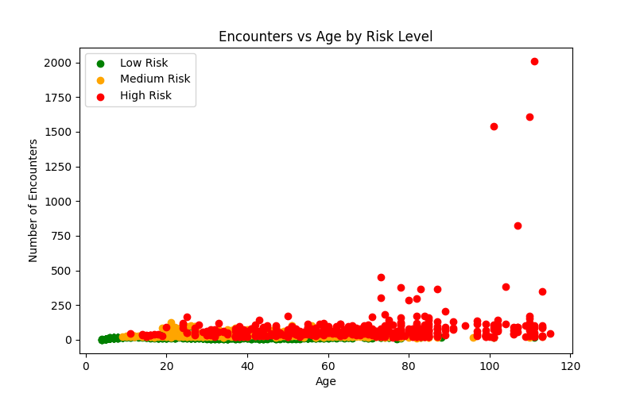
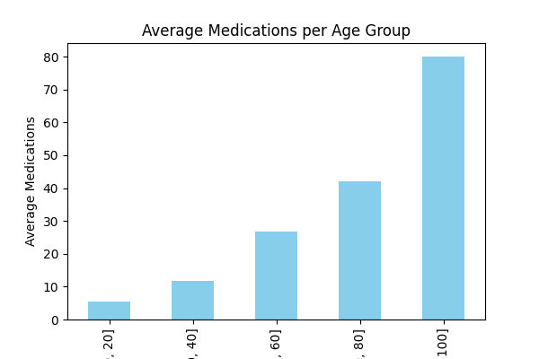
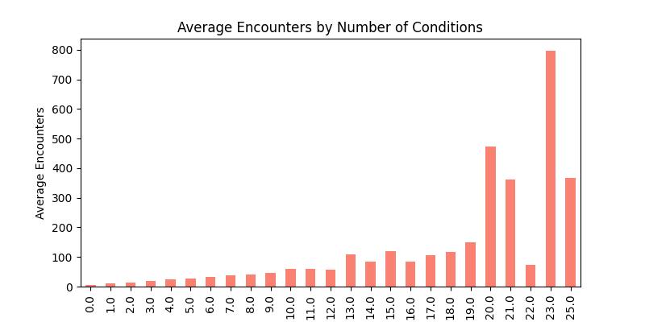
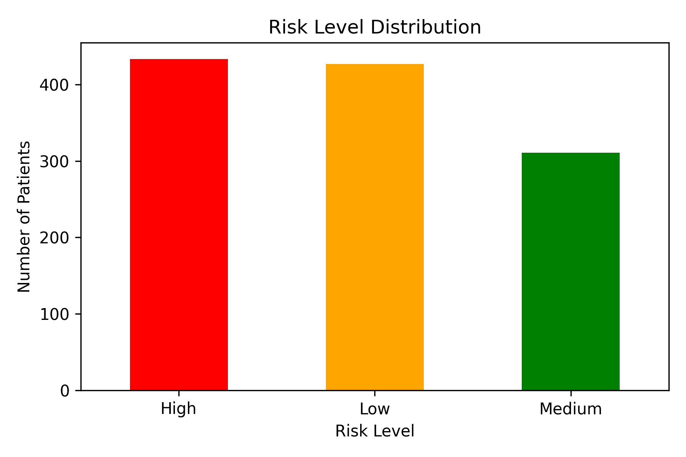

# Clinical Risk Stratification & Population Health Analytics

## Project Overview

This project develops a **data-driven risk stratification model** to identify high-risk patients within a clinical cohort. By integrating multiple clinical variables — including encounter frequency, disease burden, and polypharmacy — the analysis provides a framework for proactive intervention and optimized resource allocation.

The analysis is built on a synthetic EHR (Electronic Health Record) dataset and demonstrates a complete data science pipeline from raw data ingestion through to scored, exportable output.

**Tools used:** Python, Pandas, Matplotlib

---

## Project Files

| File | Description |
|---|---|
| `Clinical_Risk_Analysis.ipynb` | Jupyter notebook with full analysis workflow |
| `Clinical_Risk_Analysis.csv` | Processed dataset including risk scores and risk levels |
| PNG visualizations | Saved in root folder |

---

## Risk Stratification Methodology

The project uses a structured Python-based pipeline to build a multi-factorial risk scoring algorithm.

### Feature Engineering

Patient-level counts are aggregated from raw EHR datasets to create quantitative indicators of clinical complexity:

- `encounter_count` — total hospital encounters per patient
- `condition_count` — total diagnosed conditions per patient
- `medication_count` — total prescribed medications per patient
- `age` — derived from `BIRTHDATE`, calculated as of 2024

### Risk Scoring Logic

Each patient receives a risk score based on the following clinical thresholds:

| Factor | Threshold | Points |
|---|---|---|
| Age | > 75 | +1 |
| Conditions | ≥ 5 | +1 |
| Encounters | ≥ 20 | +1 |
| Medications | ≥ 15 | +1 |

Patients are then categorised into risk tiers based on their total score:

| Score | Risk Level |
|---|---|
| 0 – 1 | Low |
| 2 | Medium |
| 3 – 4 | High |

---

## Key Findings

### Risk Distribution

| Risk Level | Patients | Percentage |
|---|---|---|
| High | 433 | 37.0% |
| Low | 427 | 36.5% |
| Medium | 311 | 26.5% |

### Age & Utilisation Trends

Average encounters and medication counts increase sharply with age:

| Age Group | Avg Encounters | Avg Medications |
|---|---|---|
| 0 – 20 | 19.2 | 5.5 |
| 21 – 40 | 34.5 | 11.7 |
| 41 – 60 | 38.0 | 26.9 |
| 61 – 80 | 48.8 | 42.1 |
| 81 – 100 | 67.6 | 80.1 |

### Clinical Intensity by Disease Burden

Patients with more diagnosed conditions show higher encounter rates:

| Conditions | Avg Encounters |
|---|---|
| 0 – 1 | 11.8 |
| 1 – 2 | 13.7 |
| 2 – 3 | 18.9 |
| 3 – 4 | 24.8 |
| 4 – 10 | 38.5 |

### Gender Distribution

The cohort is nearly evenly split: 52.0% female, 48.0% male.

---

## Visualizations

### Encounters vs Age by Risk Level

### Average Medications per Age Group

### Average Encounters by Number of Conditions

### Risk Level Distribution

---

## Data Quality Note — Medication Count Outliers

The dataset shows a large gap between mean and median medication counts. Mean ≈ 36, median = 7, max > 3,000. Outliers were retained to preserve dataset structure. In production workflows, preprocessing like outlier detection or capping would normally be applied.

---

## About

Portfolio project demonstrating clinical risk stratification and population health analytics using Python and Pandas.
